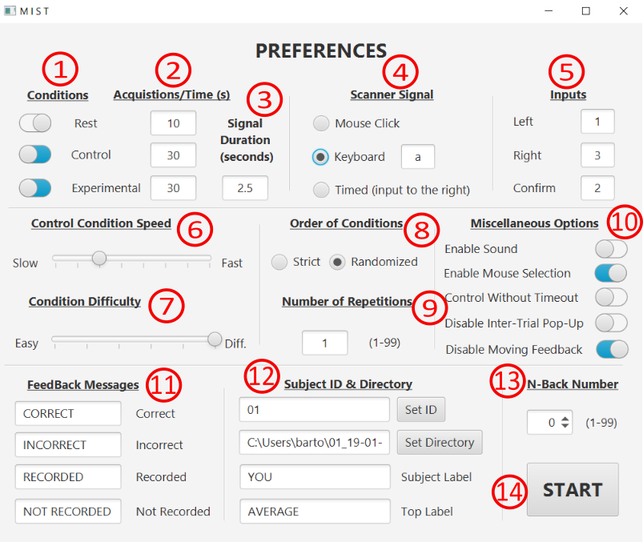

# MIST
The Montreal Imaging Stress Task v2 developed circa 2015.

## Background
This is an updated version of the [Montreal Imaging Stress Task](https://www.ncbi.nlm.nih.gov/pmc/articles/PMC1197276/), itself an adaptation of the [TSST](https://pubmed.ncbi.nlm.nih.gov/8255414/).  The MIST was designed to investigate social stress in a scanner setting.
The original version was written in HyperCard (now SuperCard); the update to Java was much needed.  This version uses [JideFX](https://github.com/jidesoft/jidefx-oss) for better UI features.

Added features include:
1. Ability to arbitrarily resize the window.
2. Use of the mouse to select inputs.
3. Toggling inter-trial feedback.
4. Toggling test condition visual feedback.
5. Various QoL updates for use.

## Running the MIST
This version of the MIST was written and deployed using JDK 8u66.  It should work one any later JRE versions as well.  Some users have reported issues with older JRE's.

To run the MIST download the .jar file and the resources folder[1](#f1).

After the initial screen you will be presented with this screen:

<b id="f1">1</b>: The resources folder contains the audio files for the sound feedback in the MIST.  Due to laziness on my part, if you launch the app in a location without the `resources/sound` folder AND enable sound feedback, the app will crash.  If you are not using sound, just disable the feature and you can launch the app from anywhere.[↩](#a1)
